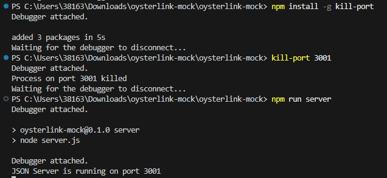

# Visual Studio Code terminal commands

Here are some useful commands to use while working on projects.


## Kill Port

First, install the plugin

```bash
npm install -g kill-port
```
Then run the following command to kill your currently active port
```bash
kill-port 3001
```
After this the server port is closed and can be restarted by command like:
```bash
npm run server
```


## npm install

### npm install vulnerabilities
When npm install shows vulnerabilities we should run an audit fix
```bash
npm audit fix --force
```
After that check if there are still some vulnerabilities:
```bash
npm audit
```


### Remove/delete node modules and package-lock.json after a wrong installation
Run this command
```bash
Remove-Item -Path node_modules,package-lock.json -Recurse -Force
```
-Path node_modules,package-lock.json: Specifies both items.

-Recurse: Deletes the node_modules folder and its contents.

-Force: Suppresses confirmation prompts.

Instantly install dependencied after the node & package.lock has been removed
```bash
Remove-Item -Path node_modules,package-lock.json -Recurse -Force
npm install
```

## Jest

### Clear Jest Cache
```bash
npx jest --clearCache
```
